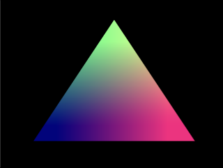
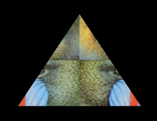
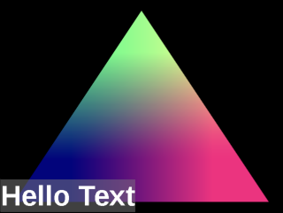
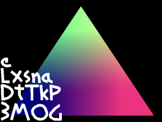

# emscripten-sdl2-ogles2
*OpenGL to WebGL using Emscripten*
        
This is a collection of C++/SDL2/OpenGL samples that run in the browser via Emscripten.  
These samples demonstrate the basics of porting desktop graphics apps to the browser.
Specifically code written in C++, SDL2, and OpenGLES2 code is transpiled into Javascript and WebGL by Emscripten.
        
## Samples

### [Run Hello Triangle](https://erik-larsen.github.io/emscripten-sdl2-ogles2/hello_triangle.html)

Demonstrates a colorful triangle using shaders, with support for mouse and touch input:
 * Pan using left mouse or finger drag.
 * Zoom using mouse wheel or pinch gesture.

### [Run Hello Texture](https://erik-larsen.github.io/emscripten-sdl2-ogles2/hello_texture.html)

Demonstrates a textured triangle, using SDL to load an image from a file.

### [Run Hello Text](https://erik-larsen.github.io/emscripten-sdl2-ogles2/hello_text_ttf.html)

Demonstrates TrueType text, using SDL to render a string into a texture and apply it to a quad.

### [Run Hello Texture Atlas](https://erik-larsen.github.io/emscripten-sdl2-ogles2/hello_text_txf.html)

Demonstrates SGI's Texfont text, loading a font texture atlas from a .txf file and applying it to a quad, as well as rendering of text strings.

## Motivation

### Why Emscripten?  

Running an app in the browser is the ultimate convenience for the user.  No need to manually install anything, and the app can run equally well on desktop, tablet, and phone.  Emscripten does the work to produce optimal Javascript/WASM, which replaces the manual, boring, and error-prone task of hand porting C++ code.

### Why SDL2? 

These demos require OS-dependent stuff (keyboard, mouse, touch, text, audio, networking, etc.). SDL provides a cross-platform library to access this.

### Why OpenGLES2?  

WebGL is the way to get GPU-accelerated graphics in the browser, and OpenGLES is the non-web version of OpenGL which most closely matches WebGL.