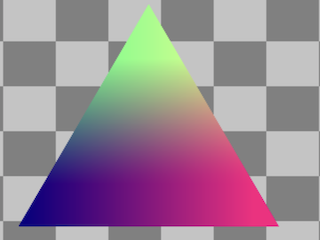

# emscripten-sdl2-ogles2
*OpenGL to WebGL using Emscripten*

Demonstrates the basics of porting desktop graphics to the web using Emscripten, via a collection of code samples. Code is written in C++, SDL2, and OpenGLES2 and transpiled into Javascript and WebGL by Emscripten.

### [Run Hello Triangle Minimal](https://erik-larsen.github.io/emscripten-sdl2-ogles2/hello_triangle_minimal.html) ([source](https://github.com/erik-larsen/emscripten-sdl2-ogles2/blob/master/src/hello_triangle_minimal.cpp))

Demonstrates a minimal example of a triangle using shaders, with all code in one file.  No user input.

### [Run Hello Triangle](https://erik-larsen.github.io/emscripten-sdl2-ogles2/hello_triangle.html) ([source](https://github.com/erik-larsen/emscripten-sdl2-ogles2/blob/master/src/hello_triangle.cpp))

Demonstrates a colorful triangle using shaders, with support for mouse and touch input:
 * Pan using left mouse or finger drag.
 * Zoom using mouse wheel or pinch gesture.

### [Run Hello Texture](https://erik-larsen.github.io/emscripten-sdl2-ogles2/hello_texture.html) ([source](https://github.com/erik-larsen/emscripten-sdl2-ogles2/blob/master/src/hello_texture.cpp))

Demonstrates a textured triangle, using SDL to load an image from a file.

### [Run Hello Text](https://erik-larsen.github.io/emscripten-sdl2-ogles2/hello_text_ttf.html) ([source](https://github.com/erik-larsen/emscripten-sdl2-ogles2/blob/master/src/hello_text_ttf.cpp))

Demonstrates TrueType text, using SDL to render a string into a texture and apply it to a quad.

### [Run Hello Texture Atlas](https://erik-larsen.github.io/emscripten-sdl2-ogles2/hello_text_txf.html) ([source](https://github.com/erik-larsen/emscripten-sdl2-ogles2/blob/master/src/hello_text_txf.cpp))

Demonstrates SGI's Texfont text, loading a font texture atlas from a .txf file and applying it to a quad, as well as rendering of text strings.

### [Run Hello Image](https://erik-larsen.github.io/emscripten-sdl2-ogles2/hello_image.html) ([source](https://github.com/erik-larsen/emscripten-sdl2-ogles2/blob/master/src/hello_image.cpp))

Demonstrates a checkberboard background texture created from an in-memory pixel array.

## Motivation

### Why Emscripten?

For users, running an app in the browser is the ultimate convenience: no need to manually install anything, and the app can run equally well on desktop, tablet, and phone.  For developers, Emscripten does the work to produce optimal Javascript/WASM, replacing the boring and error-prone process of manually porting code.

### Why SDL2?

These demos require OS-dependent stuff (keyboard, mouse, touch, text, audio, networking, etc.). SDL provides a cross-platform library to access this.

### Why OpenGLES2?

WebGL provides GPU-accelerated graphics in the browser, and OpenGLES is the subset of OpenGL which most closely matches WebGL.
